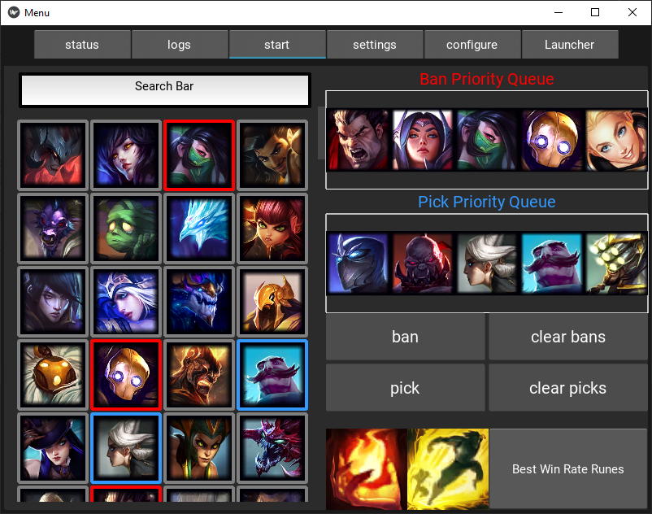
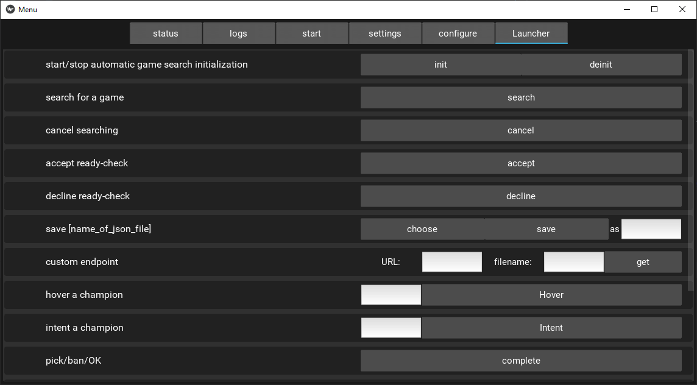

# LoL AFK Buddy
> LoL AFK Buddy is a GUI app dedicated for busy League of Legends players. 
> The app automates the stages before entering the game for the user based on a previously set configuration.
> You can watch the video showcasing how the app works [_here_](https://www.youtube.com/watch?v=WbHshdGfsWc).

## Table of Contents
* [General Info](#general-information)
* [Technologies Used](#technologies-used)
* [Development Insights](#development-insights)
* [Features](#features)
* [Screenshots](#screenshots)
* [Setup](#setup)
* [Troubleshooting](#troubleshooting)
* [Project Status](#project-status)
* [TODO](#todo)
* [Contact](#contact)
* [License](#license)
* [Endorsement](#endorsement)

## General Information
LoL AFK Buddy is meant to help everyone who wants to do stuff between games, but without wasting time queues and 
champion select. The idea appeared while playing clash with my friends, since there is often little time between games 
in the tournament and that made going to the  bathroom or getting a snack a pretty rushed experience. The project
greatly improves comfort during such events. 

## Technologies Used
- Python 3.8.10
- Kivy 2.0.0
- Asyncio
- BeautifulSoup4
- Threading
- lcu-driver
- Visual Studio Paradigm class diagrams

## Development Insights
The app logic changes during the development process from the pixel based approach using OpenCV to the current
RIOT API based one. On the planning stage of the project we decided to take advantage of design patterns. To be exact
we used Bridge, Command and State design patterns to improve the code quality. Creating UMLs in Visual Studio Paradigm
proved to be useful because it allowed features to be implemented more precisely. Object orientated design helped us
maintain high code cohesion.

## Features
- Enters queue for draft mode games.
- Bans champion from priority queue.
- Picks champion from priority queue.
- Sets predefined summoner spells.
- Applies the best possible runes from op.gg for the picked champion.

## Screenshots

## Setup
After setting up a new Python 3.8+ environment you can install all dependencies with:

`pip install -r requirements.txt`

Launching the app is as simple as writing:

`python menu.py`

or running it directly from your IDE.

## Troubleshooting
Most common issues:
- You need to have the LoL Client launched before running the app.
- Sometimes the champion pool will not update properly, and you may need to restart the app and enter the 'start' tab.
- Game dodges may break the logic behind the app and resetting the app is the best way to fix that.

## Project Status
Project is ready to use, but still under development.

## TODO
- Add message sending to the user's phone about the current stage
- Add priority queue configuration for every lane
- Add autofill managing mechanism
- UI refurbishment and clean-up
- Stability improvements

## Contact
Created by:
* [Marcin Szram](https://github.com/llwafelll)
* [Dominik Żurek](https://github.com/dominik-air)

## License
MIT License.

##Endorsement
LoL AFK Buddy isn’t endorsed by Riot Games and doesn’t reflect the views or opinions of Riot Games or anyone officially 
involved in producing or managing League of Legends. League of Legends and Riot Games are trademarks or registered 
trademarks of Riot Games, Inc. League of Legends © Riot Games, Inc.

